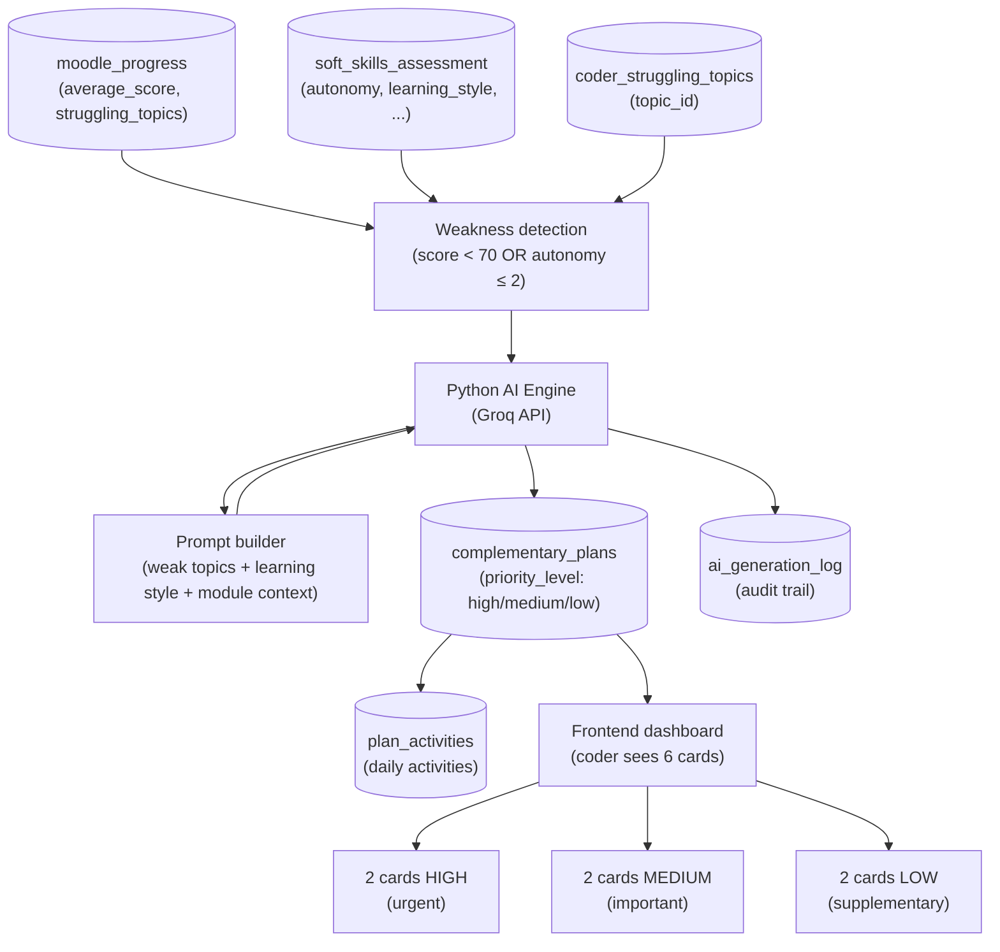

Kairo is built on a three-tier hybrid architecture. The Node.js layer handles all user-facing concerns—authentication, sessions, business logic, and frontend orchestration. The Python layer focuses exclusively on AI inference and data science workloads. PostgreSQL (via Supabase) persists everything from user profiles to AI-generated learning plans.

<CardGroup cols={3}>
  <Card title="Node.js Gateway" icon="server">
    Express 5 on port 3000. Manages auth (Passport.js + GitHub/Google OAuth), session storage, rate limiting, CORS, and proxies AI requests to the Python service.
  </Card>
  <Card title="Python AI Engine" icon="cpu">
    FastAPI on port 8000. Runs LLM inference via Groq (llama-3.3-70b-versatile / Qwen2.5-7B-Instruct), generates learning plans, risk reports, focus cards, and exercises using LangChain prompt orchestration.
  </Card>
  <Card title="PostgreSQL / Supabase" icon="database">
    14 tables, 2 analytical views, and 8 custom ENUM types. Supabase provides the managed Postgres instance, Realtime notifications, and Row Level Security policies.
  </Card>
</CardGroup>

## Service responsibilities

### Node.js gateway

The Node.js backend (`backend-node/`) is the single entry point for the frontend. It is responsible for:

- **Authentication** — email/password with bcrypt, GitHub OAuth, and Google OAuth via Passport.js. Sessions are persisted in PostgreSQL using `connect-pg-simple`.
- **Business logic** — coder progress tracking, plan assignment, evidence submission, and TL feedback delivery.
- **Service orchestration** — proxies all AI requests from the frontend to the Python microservice at `PYTHON_API_URL`.
- **Security** — rate limiting on auth endpoints (20 req / 15 min), OTP limiting (5 req / 10 min), and CORS enforcement keyed to `FRONTEND_URL`.

API route groups exposed under `/api`:

| Prefix | Purpose |
|---|---|
| `/api/auth` | Login, registration, OAuth callbacks, OTP |
| `/api/coder` | Coder dashboard data, progress, plans |
| `/api/tl` | Team Leader analytics and coder management |
| `/api/ai` | Proxied AI endpoints (plan generation, reports) |
| `/api/diagnostics` | Soft-skills assessment |
| `/api/notifications` | TL feedback notifications |
| `/api/profile` | Profile management |
| `/api/health` | Liveness check |

### Python AI engine

The Python backend (`backend-python/`) is a standalone FastAPI microservice. It is responsible for:

- **LLM inference** — calls Groq API using the configured `MODEL_NAME` (default `llama-3.3-70b-versatile`).
- **Plan generation** — builds prompt context from coder Moodle data, soft-skills snapshot, and struggling topics, then produces 6 prioritised learning plans.
- **Embeddings** — loads `all-MiniLM-L6-v2` (384-dimensional) for semantic resource search.
- **Reports and risk detection** — generates TL-facing executive summaries and flags at-risk coders.

Endpoints exposed by the AI service:

| Method | Path | Description |
|---|---|---|
| `POST` | `/generate-plan` | Generate a personalised 4-week roadmap |
| `POST` | `/generate-focus-cards` | Generate the 6 prioritised study cards |
| `POST` | `/chat/ask` | Conversational AI assistant |
| `POST` | `/generate-report` | TL executive report |
| `POST` | `/generate-exercise` | Practice exercise generation |
| `POST` | `/exercise/{id}/submit` | Submit exercise answer |
| `POST` | `/search-resources` | Semantic resource search |
| `GET` | `/health` | Liveness check |

### Database structure

The schema contains 14 tables and 2 views, grouped into five logical domains:

| Domain | Tables |
|---|---|
| User management | `users`, `soft_skills_assessment` |
| Academic progress | `modules`, `topics`, `moodle_progress`, `coder_struggling_topics` |
| Personalised plans | `complementary_plans`, `plan_activities`, `activity_progress`, `evidence_submissions` |
| Communication | `tl_feedback`, `risk_flags` |
| AI audit | `ai_reports`, `ai_generation_log` |

Two analytical views are available for dashboards:

- **`v_coder_dashboard`** — per-coder completion percentage, current module, and soft-skills snapshot.
- **`v_coder_risk_analysis`** — calculated risk level per coder combining `average_score` and `autonomy` signals.

## AI data flow

The following diagram shows how weakness detection triggers personalised plan generation and ultimately surfaces as the 6 cards in the coder dashboard.

### Step-by-step flow

| Step | What happens | Table involved |
|---|---|---|
| 1 | System detects `average_score < 70` or `autonomy ≤ 2` | `moodle_progress`, `soft_skills_assessment` |
| 2 | Struggling topics are identified for the coder | `coder_struggling_topics` |
| 3 | Python receives full context (module, learning style, weak topics) | — |
| 4 | Groq generates a prioritised plan | — |
| 5 | 6 plans are saved with `priority_level` (2 high / 2 medium / 2 low) | `complementary_plans` |
| 6 | Each plan generates daily activities | `plan_activities` |
| 7 | Frontend displays the 6 cards to the coder | — |
| 8 | Full operation is written to the audit log | `ai_generation_log` |

## ENUM types reference

| ENUM | Values |
|---|---|
| `role_enum` | `coder`, `tl` |
| `learning_style_enum` | `visual`, `auditory`, `kinesthetic`, `mixed` |
| `activity_type_enum` | `guided`, `semi_guided`, `autonomous` |
| `feedback_type_enum` | `weekly`, `activity`, `general` |
| `risk_level_enum` | `low`, `medium`, `high` |
| `priority_level_enum` | `low`, `medium`, `high` |
| `report_target_enum` | `coder`, `clan`, `cohort` |
| `ai_agent_enum` | `learning_plan`, `report_generator`, `risk_detector` |
