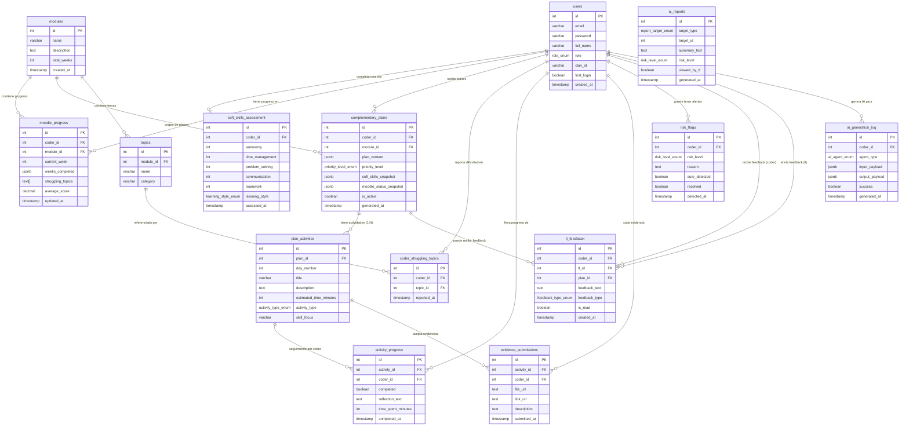

Kairo's database runs on **PostgreSQL 14+** hosted on **Supabase**. It consists of 14 tables, 2 views, and 8 custom ENUM types that power every aspect of the platform — from onboarding quizzes to AI-generated learning plans.

<Info>
  Row Level Security (RLS) is enabled on every table. Coders only see their own
  data; Team Leaders see all coders within their clan. See [Row Level
  Security](/database/rls-policies) for details.
</Info>

## At a glance

| Component    | Count | Description                                        |
| ------------ | ----- | -------------------------------------------------- |
| Tables       | 14    | Core data storage                                  |
| Views        | 2     | Pre-computed summaries for dashboards              |
| ENUM types   | 8     | Constrained value sets for roles, styles, and more |
| Engine       | —     | PostgreSQL 14+ on Supabase                         |
| Security     | —     | RLS enabled on all tables                          |

## Table groups

<CardGroup cols={2}>
  <Card title="Users" icon="users">
    `users` and `soft_skills_assessment`. Stores every coder and Team Leader
    account, plus each coder's 20-question onboarding quiz results (autonomy,
    time management, learning style, and more).
  </Card>
  <Card title="Academic" icon="book-open">
    `modules`, `topics`, `moodle_progress`, and `coder_struggling_topics`.
    Tracks bootcamp modules, their topics, each coder's academic scores synced
    from Moodle, and which topics they struggle with.
  </Card>
  <Card title="Plans" icon="layout-grid">
    `complementary_plans`, `plan_activities`, `activity_progress`, and
    `evidence_submissions`. The six AI-generated learning cards per coder, the
    daily activities inside each card, and how coders track and evidence their
    completion.
  </Card>
  <Card title="Communication" icon="message-circle">
    `tl_feedback` and `risk_flags`. Team Leader messages to coders (with unread
    notification support) and automated risk alerts triggered when a coder's
    scores or autonomy fall below thresholds.
  </Card>
  <Card title="AI" icon="cpu">
    `ai_reports` and `ai_generation_log`. AI-generated executive reports for
    Team Leaders and a full audit log of every AI call made by the platform
    (agent type, input/output payloads, execution time, success status).
  </Card>
</CardGroup>

## Entity relationship diagram

## Key relationships

| Relationship                              | Type    | Description                                              |
| ----------------------------------------- | ------- | -------------------------------------------------------- |
| `users` → `soft_skills_assessment`        | 1:1     | Each coder completes the assessment once                 |
| `users` → `complementary_plans`           | 1:N     | A coder can have up to 6 active plans at a time          |
| `complementary_plans` → `plan_activities` | 1:N     | Each plan card contains multiple daily activities        |
| `users` (TL) → `tl_feedback`             | 1:N     | A Team Leader sends feedback to many coders              |
| `moodle_progress` → `complementary_plans` | Indirect | Low scores trigger AI plan generation                   |

## Views

| View                   | Purpose                                                                                   |
| ---------------------- | ----------------------------------------------------------------------------------------- |
| `v_coder_dashboard`    | Aggregates autonomy, learning style, current module, score, and activity completion rate  |
| `v_coder_risk_analysis`| Calculates risk level: `high` when autonomy ≤ 2 **and** score < 70; `medium` when either condition is true |
