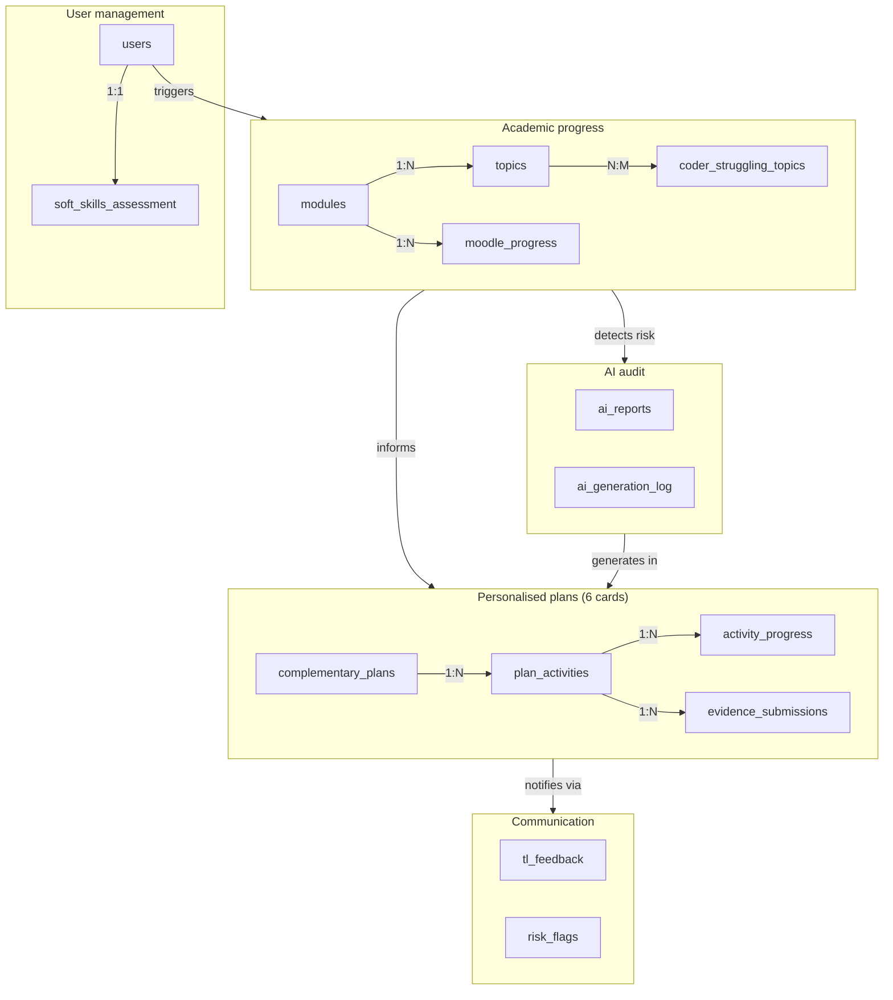

Kairo uses **PostgreSQL 14+** managed by [Supabase](https://supabase.com). Supabase provides the database, connection pooling, Row Level Security, and Realtime notifications used by the TL feedback system.

## Prerequisites

- A Supabase account (free tier is sufficient for development)
- The `schema.sql` file from the `database/` directory of the repository

<Steps>
  <Step title="Create a Supabase project">
    1. Go to [supabase.com](https://supabase.com) and sign in.
    2. Click **New project** and choose an organisation.
    3. Set a **project name** (e.g. `kairo-dev`) and a strong **database password**. Save the password — you'll need it for `DB_PASSWORD` and `DATABASE_URL`.
    4. Select a region close to your users and click **Create new project**.
    5. Wait for provisioning to complete (roughly 1–2 minutes).
  </Step>

  <Step title="Retrieve connection details">
    In your Supabase dashboard, navigate to **Settings > Database**. Copy:

    | Variable | Where to find it |
    |---|---|
    | `DB_HOST` | Host field (e.g. `db.<project-ref>.supabase.co`) |
    | `DB_PORT` | `5432` |
    | `DB_NAME` | `postgres` |
    | `DB_USER` | `postgres.<project-ref>` |
    | `DB_PASSWORD` | The password you set on project creation |

    The full `DATABASE_URL` follows this format:

    ```
    postgresql://postgres.<project-ref>:<password>@db.<project-ref>.supabase.co:5432/postgres
    ```

    Navigate to **Settings > API** and copy:

    | Variable | Where to find it |
    |---|---|
    | `SUPABASE_URL` | Project URL |
    | `SUPABASE_ANON_KEY` | `anon` / `public` key |
    | `SUPABASE_SERVICE_KEY` | `service_role` key (Python backend only) |
  </Step>

  <Step title="Run the schema">
    Open the **SQL Editor** in your Supabase dashboard (or use `psql`) and run the full contents of `database/schema.sql`.

    The script creates **8 ENUM types** first — they must exist before any tables are created:

    | ENUM | Values |
    |---|---|
    | `role_enum` | `coder`, `tl` |
    | `learning_style_enum` | `visual`, `auditory`, `kinesthetic`, `mixed` |
    | `activity_type_enum` | `guided`, `semi_guided`, `autonomous` |
    | `feedback_type_enum` | `weekly`, `activity`, `general` |
    | `risk_level_enum` | `low`, `medium`, `high` |
    | `priority_level_enum` | `low`, `medium`, `high` |
    | `report_target_enum` | `coder`, `clan`, `cohort` |
    | `ai_agent_enum` | `learning_plan`, `report_generator`, `risk_detector` |

    The script then creates **14 tables** in dependency order:

    1. `users`
    2. `soft_skills_assessment`
    3. `modules`
    4. `moodle_progress`
    5. `topics`
    6. `coder_struggling_topics`
    7. `complementary_plans`
    8. `plan_activities`
    9. `activity_progress`
    10. `evidence_submissions`
    11. `tl_feedback`
    12. `risk_flags`
    13. `ai_reports`
    14. `ai_generation_log`

    Finally, two analytical **views** are created:

    - `v_coder_dashboard` — per-coder progress summary used by the coder dashboard.
    - `v_coder_risk_analysis` — calculated risk level per coder used by TL analytics.

    <Warning>
    If you need to reset the schema, uncomment the `DROP TABLE` and `DROP TYPE` block at the top of `schema.sql` before re-running. Dropping tables is irreversible — back up any data first.
    </Warning>
  </Step>

  <Step title="Run seed data (optional)">
    If a seed file is available in `database/`, run it after the schema to populate modules, topics, and sample users:

    ```sql
    -- Run in Supabase SQL Editor or psql
    \i database/seed.sql
    ```

    Seed data is recommended for local development so that plan generation has module and topic context to work with.
  </Step>

  <Step title="Configure Row Level Security">
    Supabase enables RLS on all new tables by default. The schema does not include explicit RLS policies — the application enforces access control at the API layer via Passport.js sessions.

    For development, you can disable RLS on each table via the Supabase dashboard under **Table Editor > [table] > RLS policies**, or run:

    ```sql
    ALTER TABLE users DISABLE ROW LEVEL SECURITY;
    -- Repeat for other tables as needed
    ```

    <Warning>
    Disabling RLS is acceptable for local development but must never be done in a production environment. In production, define explicit RLS policies that match your application's access patterns.
    </Warning>
  </Step>

  <Step title="Update your .env files">
    Paste the connection values you copied in step 2 into `backend-node/.env` and `backend-python/.env`.

    See [Environment configuration](/setup/environment) for the full variable reference.
  </Step>
</Steps>

## Schema overview

The 14 tables are grouped into five logical domains:


